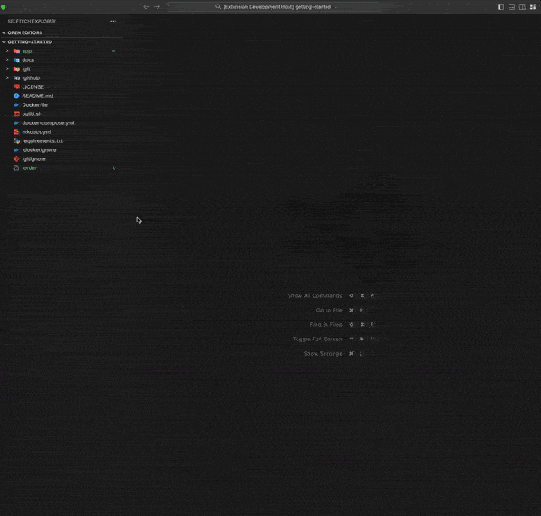

# Build your Development Ecosystem

Keep your URLs organized by storing them in .website files. With just a single click, you can swiftly navigate to API documentation, manage your databases, monitor your application's performance, track issues, view version control dashboards, collaborate with your team, the list goes on.

